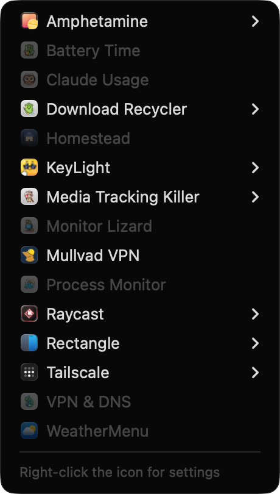

<h1 align="center">
  <br>
  Barn
</h1>

<p align="center">
  <b>Hide the menu bar icons you never click.</b><br>
  Click the barn to get them back — with their real menus, without moving a thing.
</p>

<p align="center">Part of the <a href="https://widgets.nicksmith.software">Menubarn</a> widget library.</p>

<p align="center">
  
</p>

<p align="center">
  <i>And unlike the alternatives, it cannot lose an icon.</i>
</p>

---

## Install

```sh
mkdir -p ~/Code && cd ~/Code
git clone https://github.com/nicholaspsmith/StatusItemKit.git
git clone https://github.com/nicholaspsmith/HotkeyKit.git
git clone https://github.com/nicholaspsmith/menubar-barn.git
cd menubar-barn && ./install.sh
```

That builds it, drops it in `~/Applications`, and launches it. Grant Accessibility
when prompted — it is how Barn reads where icons sit and what hidden apps'
menus contain.

Then **⌘-drag the barn** so everything you want hidden sits to its left. Or let
the app do the dragging: right-click ▸ Visible Icons, where a tick means the
icon stays on the bar and unticking it puts it in the barn.

Requires macOS 13+ and Swift 5.9; macOS 27 needs the Accessibility grant for
hiding itself, not just for the menus (see below). Run only one menu-bar
manager at a time — two fighting over the same icons will strand one.

### Start at Login

Toggle it from the menu, or from the shell:

```sh
"$HOME/Applications/Barn.app/Contents/MacOS/Barn" --login on       # or: off, status
```

`install.sh` already runs this for you. Start at Login is `SMAppService.mainApp`, which can only
register the calling process's own bundle — so nothing outside the app can turn
it on, and the command has to be the *installed* binary. A bare `--login`, or
`--login status`, only reports the current state and changes nothing.

## Using it

| | |
|---|---|
| **Left click** | the hidden icons, each with its own live menu |
| **Right click** | Visible Icons (ticked = on the bar), reveal behaviour, Icon (double chevron, barn or chevron), Start at Login, Quit |

## The menu-bar icon


The control is a double chevron in barn red — the « macOS 27 shows for its own
overflow, in Barn's colour — pointing left while the icons are in the barn
and right while they are out. Prefer the barn itself? Right click ▸ Icon ▸
Barn: doors shut while the icons are inside, open while its menu is up or the
icons are out, drawn a little larger than a normal glyph on purpose, since the
other Menubarn characters are supposed to have come out of it. The original
single chevron is there too; the bar re-measures the handle's width on its own.

A hidden app's submenu is its **real menu**, read live while its icon sits
off-screen — so a hidden app stays completely usable and nothing on your bar
moves. Apps that publish no menu open directly instead; an app that only
answers a real click (BetterDisplay) gets one: Barn reveals the bar, clicks
its icon for you, and hides again when its menu closes. Hide an icon and unhide
it later and it returns to the exact slot it left.

## Why it cannot lose an icon

Barn hides by **width**. A status item of its own grows leftward, sliding its
neighbours off the display. Items to its right never move, and no other app's
state is written.

That matters because the usual approach — Ice's, for one — is to *move* other
apps' icons, and moving is where they get lost. This project exists because an
icon vanished: the app was healthy, its item present, the accessibility API
reporting a real 32×24 slot — but the slot sat nine points from the notch, and
that sliver renders nothing. Ice had dragged it there and never checked, and
quitting Ice made the same mistake in reverse, restoring three icons straight
into the notch, all invisible. Barn cannot do either, because it never moves
an icon it did not just ask you about.

So Barn moves an icon only when you ask it to, once, and always reads back
where it landed. Anything resting somewhere invisible gets named in the menu
rather than silently disappearing.

### On macOS 27

macOS 27 moved every status item into one system process, `MenuBarAgent`,
which lays the whole bar out itself and collapses whatever does not fit into
a « of its own. Barn stands in for that «.

The agent sorts each trailing item by where its left edge would land. Past
the frontmost app's last menu it is placed; below the app's *name* (plus a
margin) it is dropped from the bar outright; in between it is an overflow
member, and that is when the agent shows its «. An item wider than half the
display is dropped wherever it sits — which is what happened to Barn's old
2000pt line.

So Barn now runs **two lines**, side by side. The right one is sized to end
just past the frontmost app's menus; the left one reaches down below the
app's name. Everything left of them is dropped, the left line is dropped with
it, and the right one sits clear of the band — no « anywhere. The split
follows the frontmost app: switch from Finder to Xcode and the lines
re-divide (two length changes, nothing moves), and Barn reads the agent's
layout back after each change and nudges if a « slipped in.

The handle is drawn as the agent's own « in barn red, so the bar looks the
way macOS taught you to expect, and the icons behind it open from Barn's
panel with their live menus instead of the system's.

When the bar is genuinely full for the app in front — its menus reach past
where the visible icons start — Barn does what the agent would: it hides
the leftmost visible icon, into the barn, and checks again. That is a real
hide, like ticking it off in Visible Icons, and it stays hidden until you
tick it back; putting it back on every app switch would need a reveal each
time. To move an icon while the bar is that full, Barn briefly takes the
menu bar itself (a regular app for a second, with a one-word menu) so the
agent lays everything out and the drag lands where it is aimed, then hands
focus back.

Two things it cannot do. The agent's overflow has no off switch, so an app
with menus wider than about half the display leaves a band no item can
cross without starting inside it; the « shows for that app and Barn says so
in its log. And it needs Accessibility to know where its own lines end and
where the frontmost app's menus do; without the grant it falls back to
guesses that usually hold.

## Known limits

- **The bar has a capacity.** Making an app visible when the strip is already full
  pushes something into the notch sliver, where it draws nothing — and on a full
  bar the leftmost thing is Barn's own handle, the control you would use to
  fix it. So Barn refuses to show an icon when the arithmetic says it will not
  fit, and tells you how many points to free by hiding something else first. If
  macOS reflows the bar unexpectedly and the handle is stranded anyway, Barn
  notices within a second and offers to hide the icon again. It still cannot
  create room.
- **A very wide hidden block cannot all be revealed at once.** Showing an icon
  means revealing the block and dragging that icon across the line, and the
  block's far end can spill under the notch if more is hidden than the bar can
  display. During the move Barn's own handle and every StatusItemKit app
  that runs a `YieldClient` give up their width, which is usually enough; if
  the icon still sits under the notch, Barn says so rather than dragging
  blind. Moving other hidden icons across the line does not help — the total
  width left of the handle is unchanged — so the cure is fewer or narrower
  icons on the bar, or more apps that yield.
- **Some apps are invisible to accessibility.** Mullvad and Raycast publish no
  status item at all, so they can be hidden but not listed or arranged for.
- **Shortcuts depend on the app.** Rows show key equivalents where an app sets
  them; Rectangle registers global hotkeys instead, so it publishes none.
- **Main display only.**
- **On macOS 27, positions live with the agent.** `NSStatusItem Preferred
  Position` is honoured only for a brand-new item, so `snapshot-positions.sh`
  captures nothing useful there; ⌘-drag is the way to rearrange.

## Design notes

`docs/superpowers/` carries the design and the plan, including the measurements
behind every constant — why a status item must fit entirely right of the notch to
render at all, why an app cannot trust its own item's window frame, and why
yielding by width rather than `isVisible` is the only way to keep a placement.

## Why not a SwiftBar plugin?

This is a standalone `.app` built on [StatusItemKit](https://github.com/nicholaspsmith/StatusItemKit), not a script under a plugin host: no SwiftBar to install, a real AppKit menu instead of rendered stdout, event-driven updates instead of a re-run timer, and an icon that keeps its place in the bar. Managing other apps' status items by width needs a live AppKit process, not a script that is re-run every few seconds. The full comparison is in [StatusItemKit's README](https://github.com/nicholaspsmith/StatusItemKit#why-not-swiftbar).

## The menu-bar suite

Part of a suite of macOS menu-bar apps that share one framework, one
build-and-sign script, and one installer. They are designed to sit in the
same bar together: consistent menus, a common **Icon** picker for shape and
colour, and cooperative hiding so no icon strands another.

| App | What it does |
|---|---|
| [Claude Usage](https://github.com/nicholaspsmith/claude-usage-menubar) | Claude Code plan limits, resets, and live agent sessions |
| [Apollo Monitor](https://github.com/nicholaspsmith/apollo-monitor-menubar) | Apollo audio-interface monitor level, plus a mixer-process watchdog |
| [Battery Time](https://github.com/nicholaspsmith/battery-time-menubar) | Time remaining, power mode, and 24h usage |
| [VPN & DNS](https://github.com/nicholaspsmith/vpn-dns-menubar) | A chameleon for Mullvad + Tailscale state, with a DNS watcher |
| [Process Monitor](https://github.com/nicholaspsmith/MacOS_Process_Monitor) | Process-count sparkline against the per-UID limit |
| [KeyLight](https://github.com/nicholaspsmith/keylight-menubar) | Ctrl+brightness keys remapped to keyboard backlight |
| [MacRecorder](https://github.com/nicholaspsmith/MacRecorder) | Screen recording with system audio |
| [Media Tracking Killer](https://github.com/nicholaspsmith/media-tracking-killer-menubar) | Kills Apple's media tracking daemons |
| [Download Recycler](https://github.com/nicholaspsmith/download-recycler-menubar) | Sweeps stale files out of ~/Downloads |
| **Barn** | Hides a block of status icons by width, so it cannot strand one |

| Framework | |
|---|---|
| [StatusItemKit](https://github.com/nicholaspsmith/StatusItemKit) | Status-item lifecycle, polling, menus, meter icons, the shared Icon picker |
| [HotkeyKit](https://github.com/nicholaspsmith/HotkeyKit) | CGEventTap engine for intercepting and remapping global keys |

Install the whole suite on a fresh Mac with
[macOS Dev Environment Setup](https://github.com/nicholaspsmith/MacOS-Dev-Environment-Setup):

```bash
git clone https://github.com/nicholaspsmith/MacOS-Dev-Environment-Setup.git
cd MacOS-Dev-Environment-Setup && ./bootstrap.sh --all
```

## License

Copyright (c) 2026 Nicholas Smith. Licensed under the
[Mozilla Public License 2.0](LICENSE). You may use, modify, sell and
redistribute this software, including inside proprietary products, provided
the copyright notice and license stay on these files and any modified
versions of them are made available under the same license.
