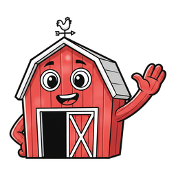

<h1 align="center">
  <br>
  Curtain
</h1>

<p align="center">
  <b>Hide the menu bar icons you never click.</b><br>
  Click the barn to get them back — with their real menus, without moving a thing.
</p>

<p align="center"></p>

<p align="center">Part of the <a href="https://widgets.nicksmith.software">Menubarn</a> widget library.</p>

<p align="center">
  
</p>

<p align="center">
  <i>And unlike the alternatives, it cannot lose an icon.</i>
</p>

---

## Install

```sh
mkdir -p ~/Code && cd ~/Code
git clone https://github.com/nicholaspsmith/StatusItemKit.git
git clone https://github.com/nicholaspsmith/HotkeyKit.git
git clone https://github.com/nicholaspsmith/menubar-curtain.git
cd menubar-curtain && ./install.sh
```

That builds it, drops it in `~/Applications`, and launches it. Grant Accessibility
when prompted — it is how Curtain reads where icons sit and what hidden apps'
menus contain.

Then **⌘-drag the barn** so everything you want hidden sits to its left. Or let
the app do the dragging: right-click ▸ Manage Icons.

Requires macOS 13+ and Swift 5.9. Run only one menu-bar manager at a time — two
fighting over the same icons will strand one.

## Using it

| | |
|---|---|
| **Left click** | the hidden icons, each with its own live menu |
| **Right click** | Manage Icons, reveal behaviour, Icon (barn or chevron), Start at Login, Quit |

## The menu-bar icon


The control is a barn: doors shut while the curtain is drawn, open while its
menu of hidden icons is up or while the icons are revealed on the bar. It is drawn a little larger than a normal glyph on purpose,
since the other Menubarn characters are supposed to have come out of it. Prefer
the original chevron? Right click ▸ Icon ▸ Chevron; the bar re-measures the
handle's width on its own.

A hidden app's submenu is its **real menu**, read live while its icon sits
off-screen — so a hidden app stays completely usable and nothing on your bar
moves. Apps that publish no menu open directly instead; an app that only
answers a real click (BetterDisplay) gets one: Curtain reveals the bar, clicks
its icon for you, and hides again when its menu closes. Hide an icon and unhide
it later and it returns to the exact slot it left.

## Why it cannot lose an icon

Curtain hides by **width**. A status item of its own grows leftward, sliding its
neighbours off the display. Items to its right never move, and no other app's
state is written.

That matters because the usual approach — Ice's, for one — is to *move* other
apps' icons, and moving is where they get lost. This project exists because an
icon vanished: the app was healthy, its item present, the accessibility API
reporting a real 32×24 slot — but the slot sat nine points from the notch, and
that sliver renders nothing. Ice had dragged it there and never checked, and
quitting Ice made the same mistake in reverse, restoring three icons straight
into the notch, all invisible. Curtain cannot do either, because it never moves
an icon it did not just ask you about.

So Curtain moves an icon only when you ask it to, once, and always reads back
where it landed. Anything resting somewhere invisible gets named in the menu
rather than silently disappearing.

## Known limits

- **The bar has a capacity.** Making an app visible when the strip is already full
  pushes something into the notch sliver, where it draws nothing — and on a full
  bar the leftmost thing is Curtain's own handle, the control you would use to
  fix it. So Curtain refuses to show an icon when the arithmetic says it will not
  fit, and tells you how many points to free by hiding something else first. If
  macOS reflows the bar unexpectedly and the handle is stranded anyway, Curtain
  notices within a second and offers to hide the icon again. It still cannot
  create room.
- **A very wide hidden block cannot all be revealed at once.** Showing an icon
  means revealing the block and dragging that icon across the line, and the
  block's far end can spill under the notch if more is hidden than the bar can
  display. During the move Curtain's own handle and every StatusItemKit app
  that runs a `YieldClient` give up their width, which is usually enough; if
  the icon still sits under the notch, Curtain says so rather than dragging
  blind. Moving other hidden icons across the line does not help — the total
  width left of the handle is unchanged — so the cure is fewer or narrower
  icons on the bar, or more apps that yield.
- **Some apps are invisible to accessibility.** Mullvad and Raycast publish no
  status item at all, so they can be hidden but not listed or arranged for.
- **Shortcuts depend on the app.** Rows show key equivalents where an app sets
  them; Rectangle registers global hotkeys instead, so it publishes none.
- **Main display only.**

## Design notes

`docs/superpowers/` carries the design and the plan, including the measurements
behind every constant — why a status item must fit entirely right of the notch to
render at all, why an app cannot trust its own item's window frame, and why
yielding by width rather than `isVisible` is the only way to keep a placement.

## Why not a SwiftBar plugin?

This is a standalone `.app` built on [StatusItemKit](https://github.com/nicholaspsmith/StatusItemKit), not a script under a plugin host: no SwiftBar to install, a real AppKit menu instead of rendered stdout, event-driven updates instead of a re-run timer, and an icon that keeps its place in the bar. Managing other apps' status items by width needs a live AppKit process, not a script that is re-run every few seconds. The full comparison is in [StatusItemKit's README](https://github.com/nicholaspsmith/StatusItemKit#why-not-swiftbar).

## The menu-bar suite

Part of a suite of macOS menu-bar apps that share one framework, one
build-and-sign script, and one installer. They are designed to sit in the
same bar together: consistent menus, a common **Icon** picker for shape and
colour, and cooperative hiding so no icon strands another.

| App | What it does |
|---|---|
| [Claude Usage](https://github.com/nicholaspsmith/claude-usage-menubar) | Claude Code plan limits, resets, and live agent sessions |
| [Apollo Monitor](https://github.com/nicholaspsmith/apollo-monitor-menubar) | Universal Audio Apollo monitor level, plus a UA process watchdog |
| [Battery Time](https://github.com/nicholaspsmith/battery-time-menubar) | Time remaining, power mode, and 24h usage |
| [VPN & DNS](https://github.com/nicholaspsmith/vpn-dns-menubar) | A chameleon for Mullvad + Tailscale state, with a DNS watcher |
| [Process Monitor](https://github.com/nicholaspsmith/MacOS_Process_Monitor) | Process-count sparkline against the per-UID limit |
| [KeyLight](https://github.com/nicholaspsmith/keylight-menubar) | Ctrl+brightness keys remapped to keyboard backlight |
| [MacRecorder](https://github.com/nicholaspsmith/MacRecorder) | Screen recording with system audio |
| [Media Tracking Killer](https://github.com/nicholaspsmith/media-tracking-killer-menubar) | Kills Apple's media tracking daemons |
| [Download Recycler](https://github.com/nicholaspsmith/download-recycler-menubar) | Sweeps stale files out of ~/Downloads |
| **Curtain** | Hides a block of status icons by width, so it cannot strand one |

| Framework | |
|---|---|
| [StatusItemKit](https://github.com/nicholaspsmith/StatusItemKit) | Status-item lifecycle, polling, menus, meter icons, the shared Icon picker |
| [HotkeyKit](https://github.com/nicholaspsmith/HotkeyKit) | CGEventTap engine for intercepting and remapping global keys |

Install the whole suite on a fresh Mac with
[macOS Dev Environment Setup](https://github.com/nicholaspsmith/MacOS-Dev-Environment-Setup):

```bash
git clone https://github.com/nicholaspsmith/MacOS-Dev-Environment-Setup.git
cd MacOS-Dev-Environment-Setup && ./bootstrap.sh --all
```
