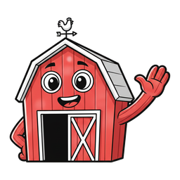
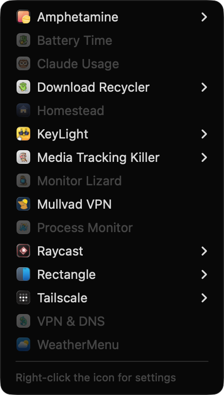

<h1 align="center">
  <br>
  Barn
</h1>

<p align="center">
  <b>Hide the menu bar icons you never click.</b><br>
  Click the barn to get them back — with their real menus, without moving a thing.
</p>

> [!WARNING]
> **Barn works only on macOS 26 and earlier.** On macOS 27 the system's
> `MenuBarAgent` lays out the bar and collapses the overflow itself, and Barn
> fights it. Hide icons in **System Settings ▸ Menu Bar** instead. Launched on
> macOS 27 or later, Barn posts a notification, turns off its Start at Login,
> and quits.

<p align="center">
  
</p>

<p align="center">
  <i>And unlike the alternatives, it cannot lose an icon.</i>
</p>

---

**Version 1.4.0** · [Changelog](https://github.com/nicholaspsmith/menubar-barn/releases)

## Install

```sh
mkdir -p ~/Code && cd ~/Code
git clone https://github.com/nicholaspsmith/StatusItemKit.git
git clone https://github.com/nicholaspsmith/HotkeyKit.git
git clone https://github.com/nicholaspsmith/menubar-barn.git
cd menubar-barn && ./install.sh
```

`install.sh` builds `Barn.app` (`scripts/build-app.sh`, which runs
StatusItemKit's `make-app.sh`), symlinks it into `~/Applications`, offers to
turn on Start at Login, and launches it, quitting any running copy first.
StatusItemKit and HotkeyKit must be checked out beside this repo: `Package.swift`
refers to them by path. Grant Accessibility when prompted; Barn uses it to read
where icons sit and what hidden apps' menus contain.

Then **⌘-drag the barn** so everything you want hidden sits to its left, or
left-click it and untick whatever you would rather not see: every app is a
row, ticked while its icon is out on the bar.

Requires macOS 13–26 and Swift 5.9. Run only one menu-bar manager at a time;
two fighting over the same icons will strand one.

Settings from the app's earlier name, Curtain (`com.nicholaspsmith.Curtain`),
are copied across on first launch; Accessibility must be granted again, since
macOS keys it to the bundle id (`com.nicholaspsmith.Barn`).

### Start at Login

Toggle it from the menu, or from the shell:

```sh
"$HOME/Applications/Barn.app/Contents/MacOS/Barn" --login on       # or: off, status
```

Start at Login is `SMAppService.mainApp`, which can register only the calling
process's own bundle, so the command must run the *installed* binary. A bare
`--login`, or `--login status`, only reports the current state.

## Using it

| | |
|---|---|
| **Left click** | The panel: every menu-bar app, each with its own tick. Click the tick to move that icon across the line; click the name for the live menu of an app in the barn, or to open an app that publishes no menu. |
| **Right click** | Panel Order… (drag the list into any order; A–Z until you do), When Showing (click to hide again, or hide automatically), Icon (double chevron, barn or chevron), Start at Login, Version, Quit. |

A warning at the top of the right-click menu (an icon cut off at the screen
edge or lost in the notch) is also its fix: click it and Barn tucks the icon
in, or re-settles the barn when the icon is already in the block but not
pushed far enough. Without Accessibility, the warning is "Grant
Accessibility…".

## The menu-bar icon


The handle is a double chevron in barn red by default, pointing left while the
icons are in the barn and right while they are out. Right click ▸ Icon offers
two others: a barn whose doors are shut while the icons are hidden and open
while they are out, and a single chevron. The bar re-measures the handle's
width when it changes.

A hidden app's submenu is its **real menu**, read live through Accessibility
while its icon sits off-screen, so a hidden app stays usable and nothing on
the bar moves. Apps that publish no menu open directly instead. An app that
only answers a real click (BetterDisplay) gets one: Barn reveals the bar,
clicks the icon, and hides again when its menu closes. An icon that is hidden
and later shown returns to the slot it left.

## How it works

Barn hides by **width**. It owns two status items: a narrow handle, and a
line that grows leftward, sliding its neighbours off the display. Items to
its right never move, and no other app's state is written. (Two items because
macOS renders a status item only when its slot fits entirely right of the
notch, so the wide line is always invisible and the control must be separate.)

Barn moves another app's icon only when you ask it to, once, and always reads
back where it landed. Anything resting somewhere invisible is named in the
menu rather than silently disappearing.

While Barn reveals hidden icons, every StatusItemKit app that runs a
`YieldClient` hides its own item briefly to free room (`MenuBarYield` in
StatusItemKit). The request carries a TTL, so a crashed Barn cannot leave
those icons hidden.

The source keeps the macOS 27 code paths (`AXHostedBar`, `HostedBar`, a
second line), though Barn now quits at launch there. Design notes, including
the measurements behind every constant, are in `docs/superpowers/`.

## Known limits

- **The bar has a capacity.** Showing an app when the strip is already full
  pushes something into the notch sliver, where it draws nothing, and on a
  full bar the leftmost item is Barn's own handle. So Barn refuses to show an
  icon that will not fit and says how many points to free by hiding something
  else first. If macOS reflows the bar and strands the handle anyway, Barn
  notices within a second and offers to hide the icon again. It cannot create
  room.
- **A very wide hidden block cannot all be revealed at once.** Showing an icon
  means revealing the block and dragging that icon across the line, and the
  block's far end can spill under the notch. During the move Barn's handle
  and every app with a `YieldClient` give up their width, which is usually
  enough; if the icon still sits under the notch, Barn says so rather than
  dragging blind. Moving other hidden icons across the line does not help,
  since the total width left of the handle is unchanged; the cure is fewer or
  narrower icons on the bar, or more apps that yield.
- **Some apps are invisible to Accessibility.** Mullvad and Raycast publish no
  status item there, so they can be hidden but not listed or arranged.
- **Shortcuts depend on the app.** Rows show key equivalents where an app sets
  them; an app that registers global hotkeys instead (Rectangle) shows none.
- **Main display only.**

## Development

```sh
swift build
swift test                     # BarnCore: geometry, placement, panel order, yield sessions, …
scripts/build-app.sh           # build/Barn.app
```

- `scripts/verify-menubar.sh` reports the whole menu bar and names anything
  stranded, and warns if Ice is also running (needs Accessibility for the
  terminal).
- `scripts/snapshot-positions.sh [output]` saves every app's
  `NSStatusItem Preferred Position` and writes a script that restores them;
  run it before rearranging.
- Logs: `log show --predicate 'subsystem == "com.nicholaspsmith.Barn"'`.

## Why not a SwiftBar plugin?

Barn is a standalone `.app` built on
[StatusItemKit](https://github.com/nicholaspsmith/StatusItemKit), not a script
under a plugin host. Managing other apps' status items by width needs a live
AppKit process, not a script re-run every few seconds. The full comparison is
in [StatusItemKit's README](https://github.com/nicholaspsmith/StatusItemKit#why-not-swiftbar).

## The menu-bar suite

Part of Menumon, a suite of macOS menu-bar apps that share one framework, one
build-and-sign script and one installer. They sit in the same bar together,
with consistent menus, a common **Icon** picker for shape and colour, and
cooperative hiding so no icon strands another.

| App | What it does |
|---|---|
| [Claude Usage](https://github.com/nicholaspsmith/claude-usage-menubar) | Claude Code plan limits, resets, and live agent sessions |
| [Apollo Monitor](https://github.com/nicholaspsmith/apollo-monitor-menubar) | Apollo audio-interface monitor level |
| [Battery Time](https://github.com/nicholaspsmith/battery-time-menubar) | Time remaining, power mode, and 24h usage |
| [VPN & DNS](https://github.com/nicholaspsmith/vpn-dns-menubar) | An iguana for Mullvad + Tailscale state, with a DNS watcher |
| [Mac Daddy](https://github.com/nicholaspsmith/mac-daddy-menubar) | Kills media trackers, trashes stale downloads, reaps hung processes, watches the UA mixer engine, and sweats as your process count climbs |
| [KeyLight](https://github.com/nicholaspsmith/keylight-menubar) | Ctrl+brightness keys remapped to keyboard backlight |
| [Monitor Lizard](https://github.com/nicholaspsmith/monitor-lizard-menubar) | External-monitor brightness, contrast and resolution, Night Shift, and the built-in screen from dimmer than macOS allows to XDR |
| [Homestead](https://github.com/nicholaspsmith/home-assistant-menubar) | Home Assistant dashboards and device controls in the menu |
| [SoundChain](https://github.com/nicholaspsmith/soundchain-menubar) | One chain of Audio Unit effects over all system audio |
| [Menu Crane](https://github.com/nicholaspsmith/menu-crane) | A ⌘Space launcher for apps, arithmetic, unit conversions and emoji |
| [MacRecorder](https://github.com/nicholaspsmith/MacRecorder) | Screen recording with system audio |
| **Barn** | macOS 26 and earlier only: hides a block of status icons by width (on macOS 27, use System Settings ▸ Menu Bar) |

| Framework | |
|---|---|
| [StatusItemKit](https://github.com/nicholaspsmith/StatusItemKit) | Status-item lifecycle, polling, menus, meter and mascot icons, the shared Icon picker |
| [HotkeyKit](https://github.com/nicholaspsmith/HotkeyKit) | CGEventTap engine for intercepting and remapping global keys |

Install the whole suite on a fresh Mac with
[macOS Dev Environment Setup](https://github.com/nicholaspsmith/MacOS-Dev-Environment-Setup):

```bash
git clone https://github.com/nicholaspsmith/MacOS-Dev-Environment-Setup.git
cd MacOS-Dev-Environment-Setup && ./bootstrap.sh --all
```

## Releasing

Every push to `main` is a release. Before pushing, add a dated
`## [X.Y.Z] - YYYY-MM-DD` section to the top of [`CHANGELOG.md`](CHANGELOG.md)
(minor for features, patch for fixes; turn a waiting `## [Unreleased]` into
it). When it reaches `main`, GitHub tags `vX.Y.Z` and publishes the section as
a release titled `vX.Y.Z`. Without a new version:

- a push is refused locally by the `pre-push` hook;
- a pull request **cannot merge** — `release / check` is required on `main`;
- a push that reaches `main` anyway fails the release workflow.

The one exception is `[no release]` in the tip commit's message, for changes
nothing a user runs (setup, CI, developer docs): it passes every check with no
version bump and no tag. Never tag or create a release by hand, and never
`gh pr merge --admin` past a failing check — fix the PR. After merging,
`git pull` for the tag and rebuild. `install.sh` re-arms the hook on a fresh
clone.
See [StatusItemKit — Releases](https://github.com/nicholaspsmith/StatusItemKit#releases-every-push-is-one) for the whole rule.

## License

Copyright (c) 2026 Nicholas Smith. Licensed under the
[Mozilla Public License 2.0](LICENSE). You may use, modify, sell and
redistribute this software, including inside proprietary products, provided
the copyright notice and license stay on these files and any modified
versions of them are made available under the same license.
